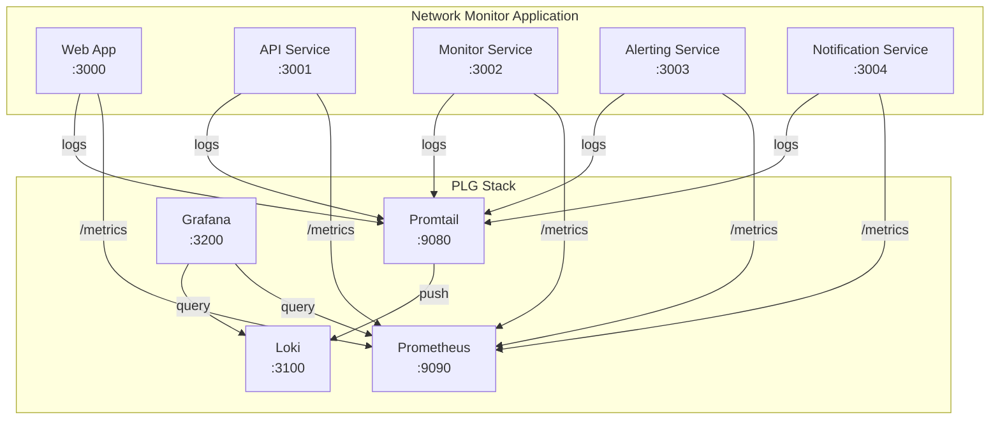

# PLG Stack Implementation Plan

> **Status**: Planning Phase  
> **Epic**: [Issue #7](https://github.com/davidsilvestrehenao-hub/network-monitor/issues/7)  
> **Start Date**: October 1, 2025

## 🎯 Overview

This document outlines the implementation plan for the **PLG Stack** (Prometheus, Loki, Grafana) observability platform for the Network Monitor application.

## 📦 Components

### Prometheus
- **Purpose**: Metrics collection and time-series storage
- **Port**: 9090
- **Features**: PromQL, alerting, service discovery
- **Data**: CPU, memory, HTTP metrics, custom application metrics

### Loki
- **Purpose**: Log aggregation and querying
- **Port**: 3100
- **Features**: LogQL, label-based indexing, efficient storage
- **Data**: Application logs, error logs, access logs

### Grafana
- **Purpose**: Unified visualization and alerting
- **Port**: 3200
- **Features**: Dashboards, alerts, multi-datasource
- **Data Sources**: Prometheus + Loki

### Promtail
- **Purpose**: Log shipping agent
- **Port**: 9080
- **Features**: Log parsing, label extraction, filtering
- **Sources**: All service logs

## 🏗️ Architecture



## 📋 Implementation Tasks

### Phase 1: Foundation (Issues #8-11)
1. **[Issue #8](https://github.com/davidsilvestrehenao-hub/network-monitor/issues/8)** - Architecture Planning & Docker Setup
   - Design architecture
   - Create Docker Compose configuration
   - Set up networking and volumes
   - **Estimated Time**: 1 day

2. **[Issue #9](https://github.com/davidsilvestrehenao-hub/network-monitor/issues/9)** - Prometheus Setup
   - Deploy Prometheus
   - Configure scrape targets
   - Set up retention policies
   - **Estimated Time**: 1-2 days

3. **[Issue #10](https://github.com/davidsilvestrehenao-hub/network-monitor/issues/10)** - Loki & Promtail Setup
   - Deploy Loki and Promtail
   - Configure log collection
   - Set up log parsing pipelines
   - **Estimated Time**: 1-2 days

4. **[Issue #11](https://github.com/davidsilvestrehenao-hub/network-monitor/issues/11)** - Grafana Setup
   - Deploy Grafana
   - Configure data sources
   - Set up authentication
   - **Estimated Time**: 1 day

### Phase 2: Integration (Issue #12)
5. **[Issue #12](https://github.com/davidsilvestrehenao-hub/network-monitor/issues/12)** - Application Integration
   - Add metrics endpoints to all services
   - Implement custom application metrics
   - Update logging to structured JSON
   - **Estimated Time**: 2-3 days

### Phase 3: Visualization (Issue #13)
6. **[Issue #13](https://github.com/davidsilvestrehenao-hub/network-monitor/issues/13)** - Dashboard Creation
   - System overview dashboard
   - Per-service dashboards
   - Log exploration dashboard
   - Business metrics dashboard
   - **Estimated Time**: 2-3 days

### Phase 4: Alerting (Issue #14)
7. **[Issue #14](https://github.com/davidsilvestrehenao-hub/network-monitor/issues/14)** - Alert Configuration
   - Define alert rules
   - Set up Alertmanager
   - Configure notification channels
   - **Estimated Time**: 1-2 days

### Phase 5: Documentation (Issue #15)
8. **[Issue #15](https://github.com/davidsilvestrehenao-hub/network-monitor/issues/15)** - Documentation
   - Architecture documentation
   - Setup guides
   - Metrics reference
   - Alert runbooks
   - **Estimated Time**: 2 days

## 📊 Total Estimated Timeline

- **Total Tasks**: 8
- **Estimated Duration**: 11-16 days
- **Recommended Approach**: 2-3 weeks for careful implementation and testing

## 🎯 Success Metrics

### Technical Metrics
- ✅ All services exposing metrics
- ✅ Logs flowing from all services
- ✅ 6+ dashboards created
- ✅ 8+ alert rules configured
- ✅ <1s dashboard load time
- ✅ <1s query response time

### Business Metrics
- ✅ 100% service health visibility
- ✅ <5 minute mean time to detection (MTTD)
- ✅ <15 minute mean time to resolution (MTTR)
- ✅ 99.9% monitoring uptime

## 📈 Metrics to Track

### Infrastructure Metrics
- CPU usage per service
- Memory consumption per service
- Disk I/O
- Network throughput
- Container health

### Application Metrics
- HTTP request rate
- Response time (p50, p95, p99)
- Error rate by status code
- Active connections
- Database query performance

### Business Metrics
- Active monitoring targets
- Speed test success rate
- Alert trigger rate
- User sessions
- Notification delivery rate

## 🚨 Alert Categories

### Critical Alerts (Immediate Action)
- Service down
- High error rate (>5%)
- Database connection issues
- Disk space critical (<10%)

### Warning Alerts (Investigation Needed)
- High CPU usage (>80%)
- High memory usage (>500MB)
- Slow response time (>2s p95)
- Speed test failures (>20%)

### Info Alerts (Awareness)
- Deployment completed
- Configuration changed
- Scheduled maintenance

## 🔧 Technology Stack

```yaml
Prometheus:
  version: latest
  image: prom/prometheus
  storage: 30 days retention
  
Loki:
  version: latest
  image: grafana/loki
  storage: 31 days retention
  
Grafana:
  version: latest
  image: grafana/grafana
  plugins:
    - grafana-clock-panel
    - grafana-piechart-panel
  
Promtail:
  version: latest
  image: grafana/promtail
```

## 📦 Dependencies

### Application Dependencies
```bash
# Prometheus client for Node.js/Bun
bun add prom-client

# Winston for structured logging
bun add winston
```

### Infrastructure Requirements
- Docker 20.10+
- Docker Compose 2.0+
- 10GB free disk space
- 2GB RAM minimum

## 🔐 Security Considerations

### Authentication
- Grafana admin credentials via environment variables
- No public access to Prometheus/Loki directly
- Use reverse proxy for production

### Data Retention
- Metrics: 30 days
- Logs: 31 days
- Configurable based on storage capacity

### Network Security
- Internal Docker network for service communication
- Only Grafana exposed externally
- TLS/SSL for production deployments

## 📚 Resources

### Official Documentation
- [Prometheus](https://prometheus.io/docs/)
- [Loki](https://grafana.com/docs/loki/latest/)
- [Grafana](https://grafana.com/docs/grafana/latest/)
- [Promtail](https://grafana.com/docs/loki/latest/clients/promtail/)

### Guides & Tutorials
- [PLG Stack Tutorial](https://grafana.com/docs/loki/latest/getting-started/get-logs-into-loki/)
- [Prometheus Best Practices](https://prometheus.io/docs/practices/)
- [Dashboard Design Guide](https://grafana.com/docs/grafana/latest/dashboards/build-dashboards/best-practices/)

### Community
- [Grafana Community](https://community.grafana.com/)
- [Prometheus Mailing List](https://groups.google.com/forum/#!forum/prometheus-users)

## 🎓 Learning Path

### For Developers
1. Understand Prometheus metrics types
2. Learn PromQL basics
3. Practice LogQL queries
4. Dashboard creation

### For Operators
1. Docker Compose deployment
2. Configuration management
3. Alert rule creation
4. Troubleshooting techniques

## 🔄 Maintenance

### Daily
- Review dashboards for anomalies
- Check active alerts
- Monitor disk usage

### Weekly
- Review metrics retention
- Update dashboards as needed
- Test alert delivery

### Monthly
- Audit alert rules
- Optimize slow queries
- Review and archive old data

## 📞 Support

For questions or issues:
- **GitHub Issues**: [Create an issue](https://github.com/davidsilvestrehenao-hub/network-monitor/issues/new)
- **Epic Issue**: [Issue #7](https://github.com/davidsilvestrehenao-hub/network-monitor/issues/7)
- **Documentation**: See `/docs/` directory

---

**Last Updated**: October 1, 2025  
**Version**: 1.0  
**Status**: Planning Phase

